# LiDAR-相机感知、标定同步与 TensorRT 部署评测系统

[English](README_EN.md) · [系统架构](docs/ARCHITECTURE.md) · [代码地图](docs/CODE_MAP.md) · [实验矩阵](docs/EXPERIMENTS.md) · [复现指南](docs/REPRODUCIBILITY.md)


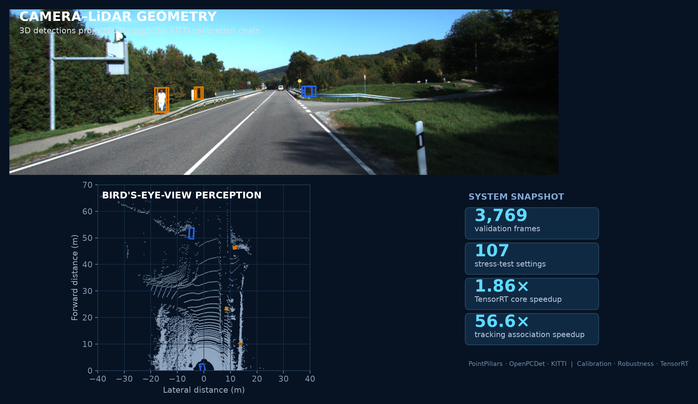

面向 LiDAR、相机与边缘计算平台构建的 3D 感知工程系统，覆盖 **数据管线、Camera-LiDAR 几何、PointPillars 训练评测、传感器退化实验、TensorRT 推理优化、在线质量分析与多目标关联**。项目以 KITTI / OpenPCDet 为公开验证载体，将模型结果扩展为一套可训练、可评测、可诊断、可部署的系统级工具链。

## 核心成果

| 感知评测 | 系统实验 | 推理部署 | 关联优化 |
|---|---|---|---|
| **3,769 帧** KITTI validation | **107 组**压力测试设置 | 核心延迟 **6.745 → 3.635 ms** | Association **47.267 → 0.836 ms** |
| Car / Ped / Cyc 官方 3D AP | **11,200 frame-runs** | TensorRT **1.86×** 加速 | 向量化实现 **56.6×** 加速 |

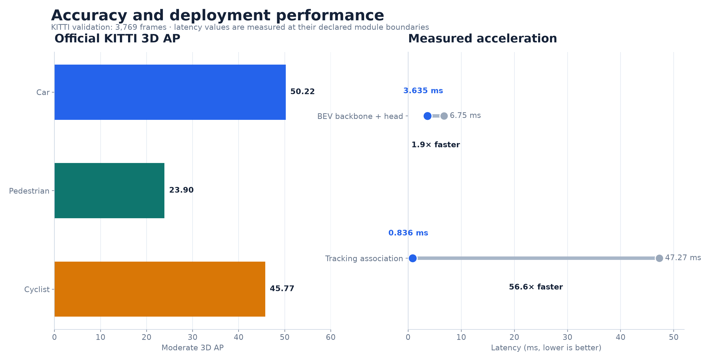

## 创新设计与验证

### 创新点 1：从“单点测速”升级为精度守恒的部署验收

项目没有只展示一组平均延迟，而是把 **官方 AP 对齐、同帧配对测速、P50/P95 尾延迟、逐帧加速比和分阶段 profiling** 组成完整部署证据链。这样可以同时回答三个工程问题：模型转为 TensorRT 后是否仍保持任务精度、加速是否覆盖大多数样本、在线瓶颈是否已经从网络前向转移到预处理或后处理。

<p align="center">
  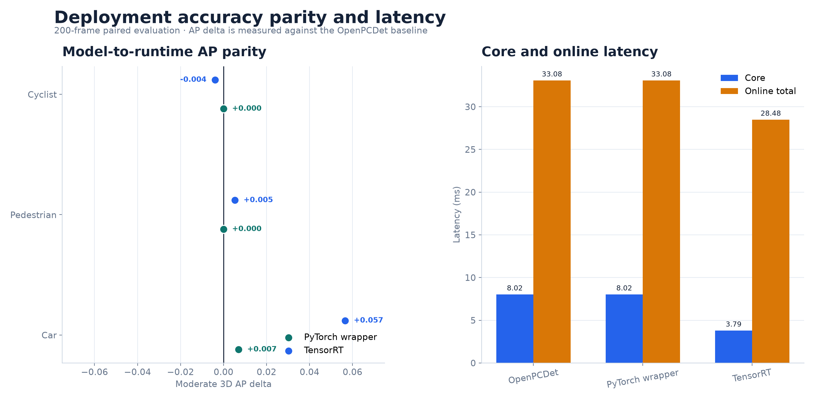
  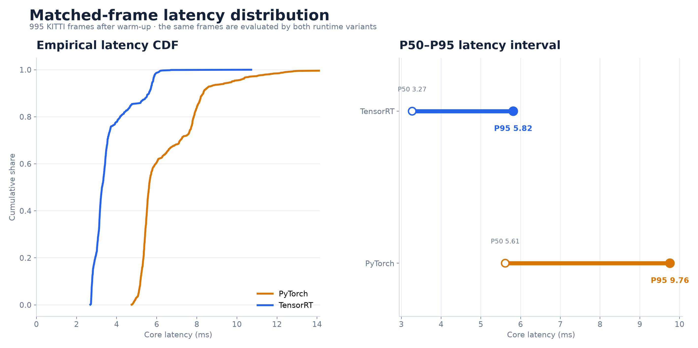
</p>
<p align="center">
  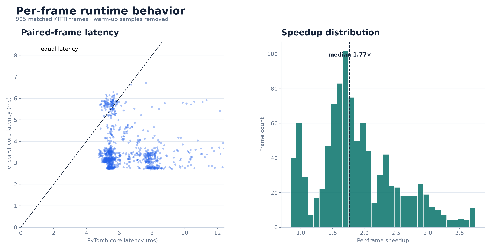
  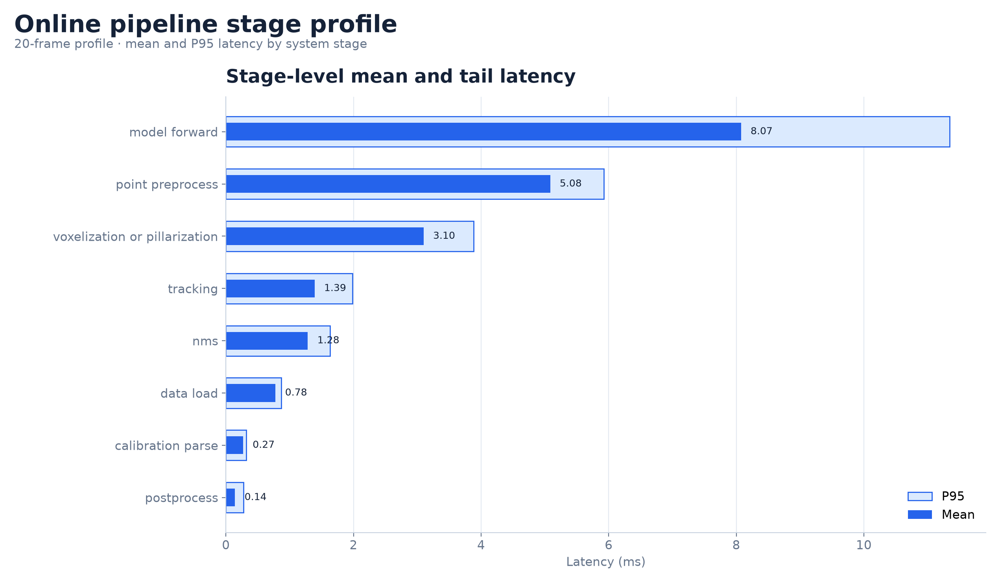
</p>

### 创新点 2：把退化实验变成可定位的失效分析

压力测试不止报告总体 AP，而是进一步拆到 **类别、距离段、预测数量、置信度与分布漂移**。从结果中可以观察到不同类别对点云稀疏的敏感性明显不同，远距离目标也更早进入失效区间；这些信号可直接用于传感器质量门限、运行告警和数据补采策略。

<p align="center">
  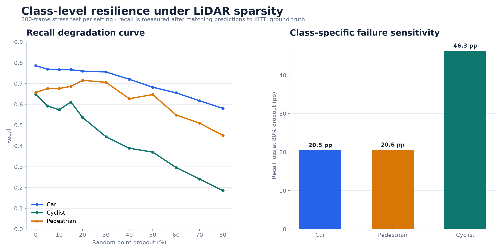
  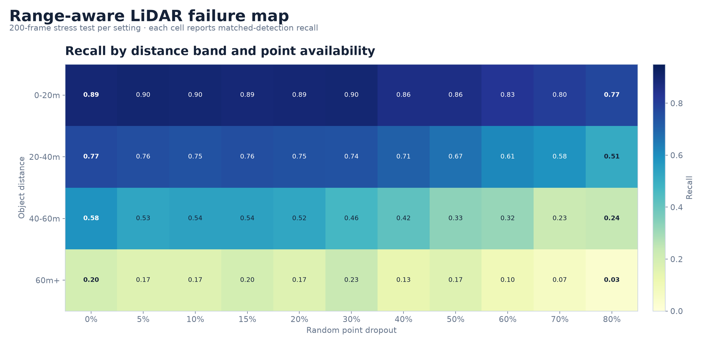
</p>
<p align="center">
  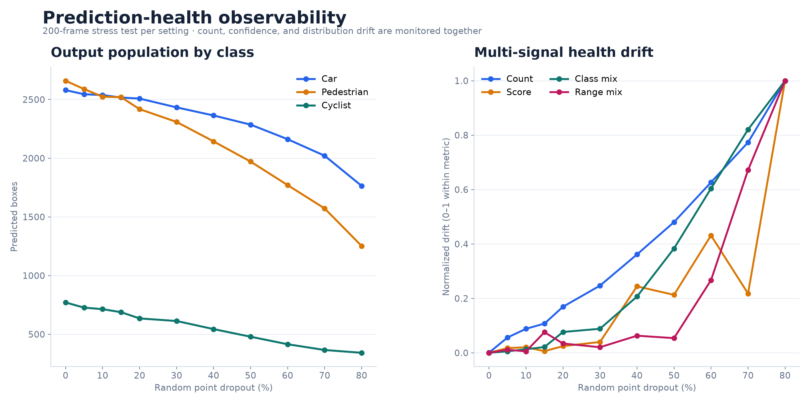
</p>

### 创新点 3：面向在线系统的向量化关联与状态审计

将 legacy association 与向量化实现放在同一批检测输入上逐帧重放，除汇总 **56.6×** 加速外，还记录 association matrix、门控后候选对、track 创建/过期和可见轨迹数量。优化因此不仅有速度结论，也保留了复杂度来源和状态一致性的审计入口。

<p align="center">
  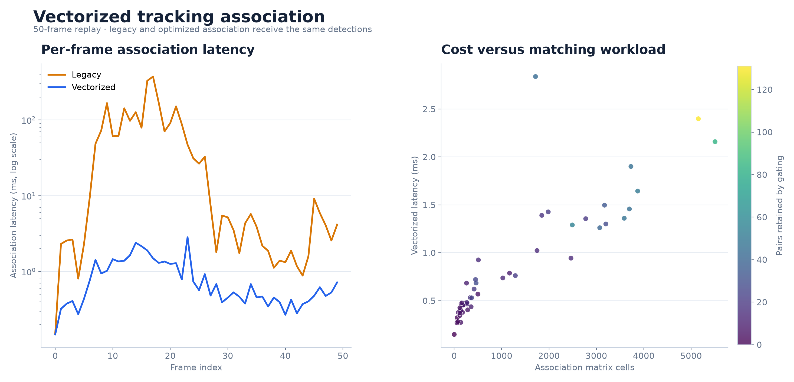
  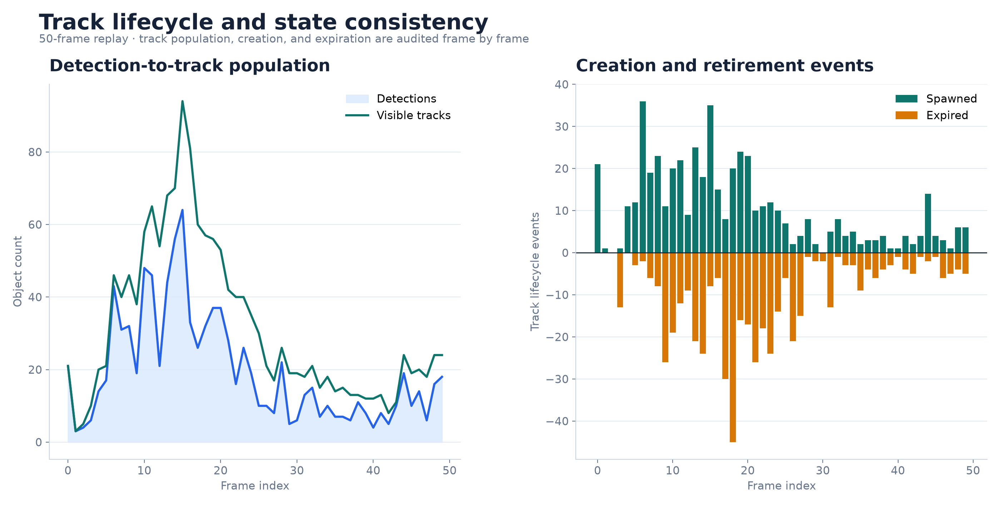
</p>

### 创新点 4：把模型、输入资源与证据资产统一纳入工程观测

项目补充了 pillar 尺寸对稀疏张量规模、内存和预处理尾延迟的资源消融，同时保留解码检测的类别、置信度与空间分布。公开图表由 **16,000+ 条机器可读记录** 重建，展示结果可以回溯到实验数据而非手工绘图。

<p align="center">
  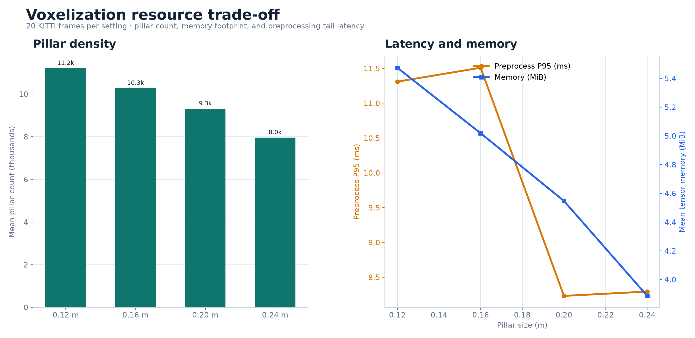
  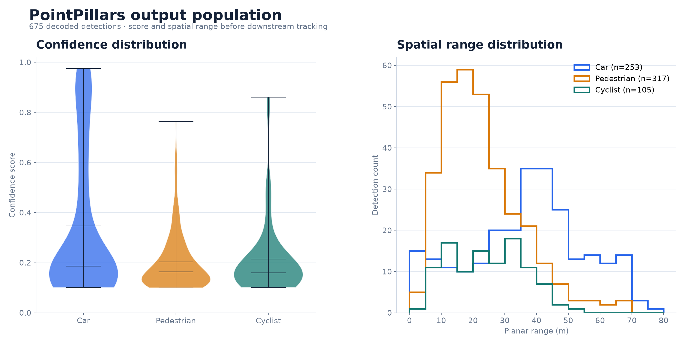
</p>
<p align="center">
  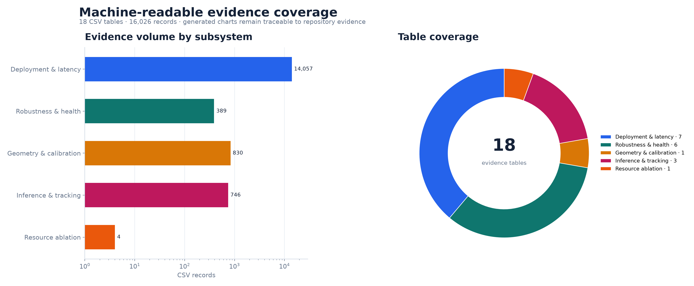
</p>

## 系统能力

### 1. LiDAR 3D 感知数据管线

- 完成 KITTI 点云、图像、标定与标签解析，构建统一 frame registry；
- 基于 OpenPCDet / PointPillars 打通体素化、训练/微调、推理、解码、NMS 与 KITTI 格式导出；
- 支持官方 AP、类别/距离分段评测、BEV 可视化与 Camera 投影检查；
- 将输入、预测、时延与运行状态写入结构化 CSV / JSON，支持批量实验与自动报告。

### 2. Camera-LiDAR 标定与同步分析

- 实现 Velodyne → Camera → Rectified Camera → Image 的完整坐标变换；
- 完成 3D box、点云和检测中心的图像投影与 BEV 几何验证；
- 构建 yaw、XYZ 平移与相邻帧偏移实验，量化重投影位移、BEV 中心漂移与关联变化；
- 对 20 帧、830 条标定/同步实验记录进行批量统计与可视化。

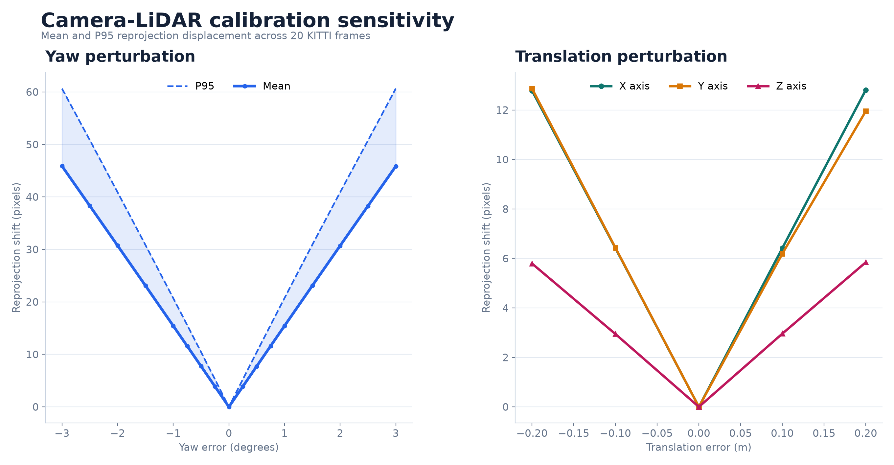

### 3. 传感器与模型压力测试

- 点云丢弃：0%–80%，覆盖稀疏回波与有效 pillar 数变化；
- 探测范围：20–70 m，分析近场与远场任务覆盖；
- 置信度阈值：0.00–0.60，评估后处理参数对结果的影响；
- 扩展分析包括点云噪声、标定扰动、帧偏移、PyTorch/TensorRT 输出一致性；
- 按类别、距离、FP/FN、置信度分布和预测数量形成多维诊断表。

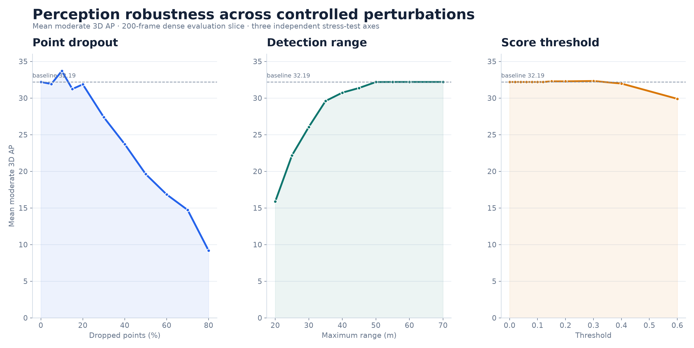

### 4. TensorRT 部署与性能优化

- 建立 wrapper parity、binding contract、动态 shape、padding、decode 与子模块误差定位脚本；
- 对 BEV backbone / dense head 完成 TensorRT 加速与 AP 对齐验证；
- 构建预处理、VFE、scatter、backbone、dense head、NMS、tracking 分阶段 profiler；
- 同时测量 engine latency 与在线总链路 latency，定位真实部署瓶颈；
- 对 tracking association 进行矩阵化距离计算、门控与局部 assignment 优化。

## 工程架构

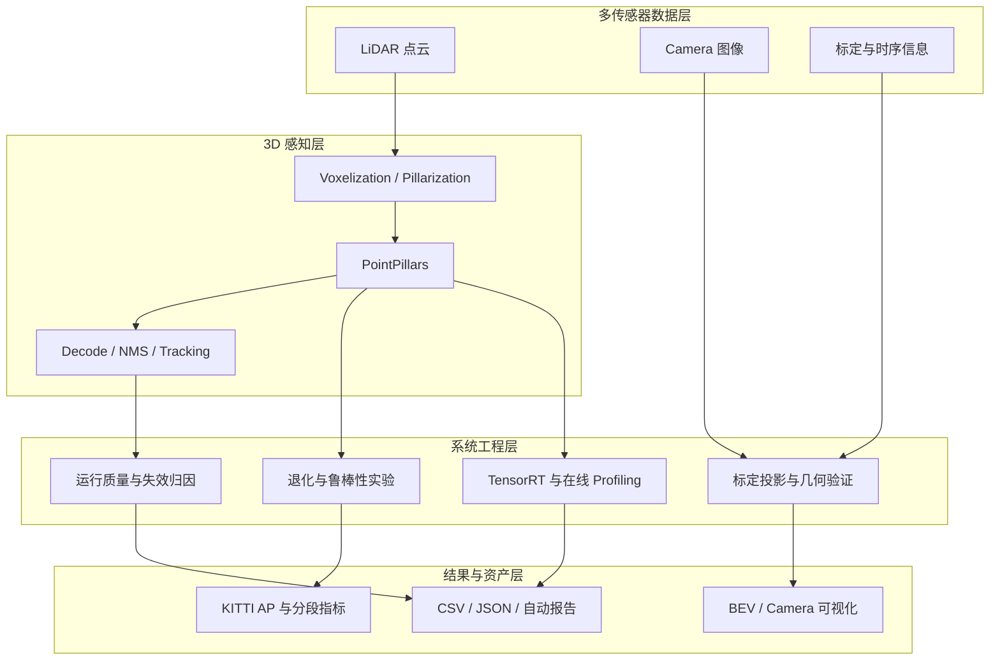

## 工程规模

| 组成 | 数量 | 代表内容 |
|---|---:|---|
| 核心运行模块 | **19** | 标定、坐标变换、tracking、profiling、部署验收、可视化 |
| 实验与工具脚本 | **50** | 训练、官方评测、退化矩阵、TensorRT bisection、报告生成 |
| 合同与回归测试 | **63** | 几何、binding、decode、tracking、评测输出与报告结构 |
| 核心代码与测试 | **23.5k+ LOC** | Python 工程实现 |
| 机器可读结果表 | **16,000+ records** | AP、FP/FN、距离分段、标定偏移、逐帧延迟、运行质量 |
| 可复现作品集图 | **16** | 全部由仓库证据表与公开样例重新生成 |

## 代码导航

```text
runtime/lidar_system_algorithm/
├── calibration.py                    # KITTI 标定解析与投影合同
├── transforms.py                     # LiDAR / Camera / Image 坐标变换
├── openpcdet_adapter.py              # OpenPCDet 模型与输出适配
├── pointpillars_wrapper_runtime.py   # PyTorch / TensorRT 运行包装
├── deployment_acceptance.py          # 批量压力测试与结果汇总
├── profiling.py                      # 分阶段延迟采集
├── online_latency.py                 # 在线链路延迟统计
├── failure_matcher.py                # 类别与距离维度归因
└── tracking.py                       # Legacy / optimized association

scripts/lidar_system_algorithm/
├── run_kitti_*                       # 数据、推理、官方评测与 failure analysis
├── run_calibration_*                 # 标定与时序灵敏度实验
├── run_pointpillars_*                # 训练、微调与性能分析
├── run_tensorrt_*                    # TensorRT 构建、评测与在线 profiling
├── debug_tensorrt_*                  # 子模块精度定位与 bisection
└── generate_*                        # 图表、dashboard 与报告生成
```

详细入口见 [代码地图](docs/CODE_MAP.md)。全部作品集图由 [`generate_portfolio_figures.py`](scripts/portfolio/generate_portfolio_figures.py) 从机器可读结果重新生成。

## 快速测试

```bash
python -m venv .venv
source .venv/bin/activate
pip install -e ".[dev,visualization]"
pytest -q \
  tests/test_lidar_calibration.py \
  tests/test_lidar_transforms.py \
  tests/test_lidar_tracking.py \
  tests/test_lidar_tracking_optimized.py \
  tests/test_lidar_dbscan_baseline.py \
  tests/test_lidar_failure_matcher.py
```

完整 PointPillars 与 TensorRT 实验配置见 [复现指南](docs/REPRODUCIBILITY.md)。KITTI 数据、模型权重与 TensorRT engine 由使用者按各自许可自行准备。

## 许可证

原创代码、文档与图表采用 [PolyForm Noncommercial 1.0.0](LICENSE.md)：允许个人学习、学术研究和非商业实验、修改与再分发，禁止未经授权的商业使用。第三方组件与数据遵循各自条款，详见 [NOTICE](NOTICE.md) 与 [THIRD_PARTY](THIRD_PARTY.md)。
