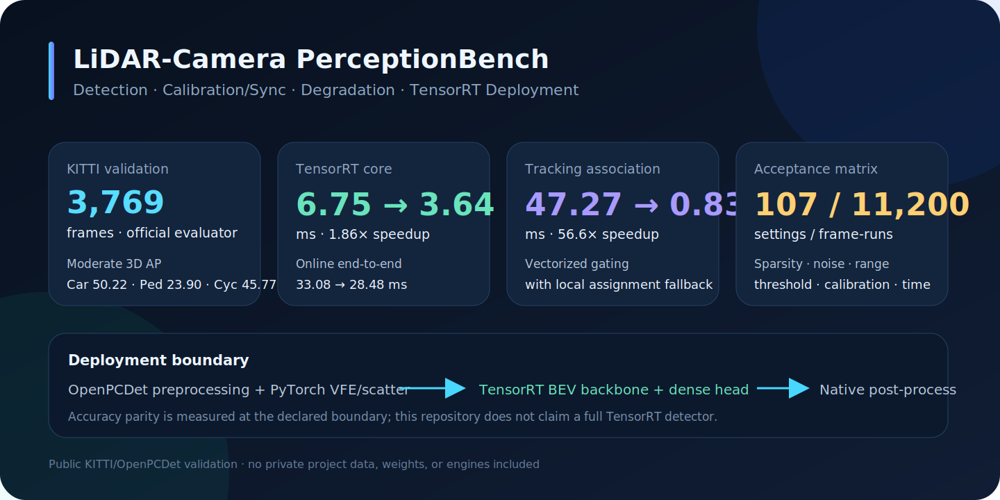
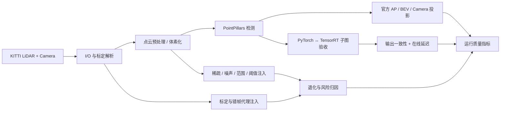
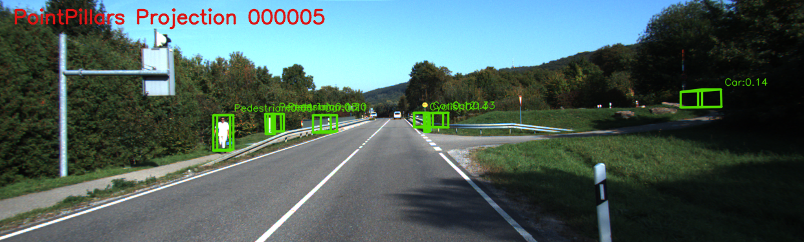
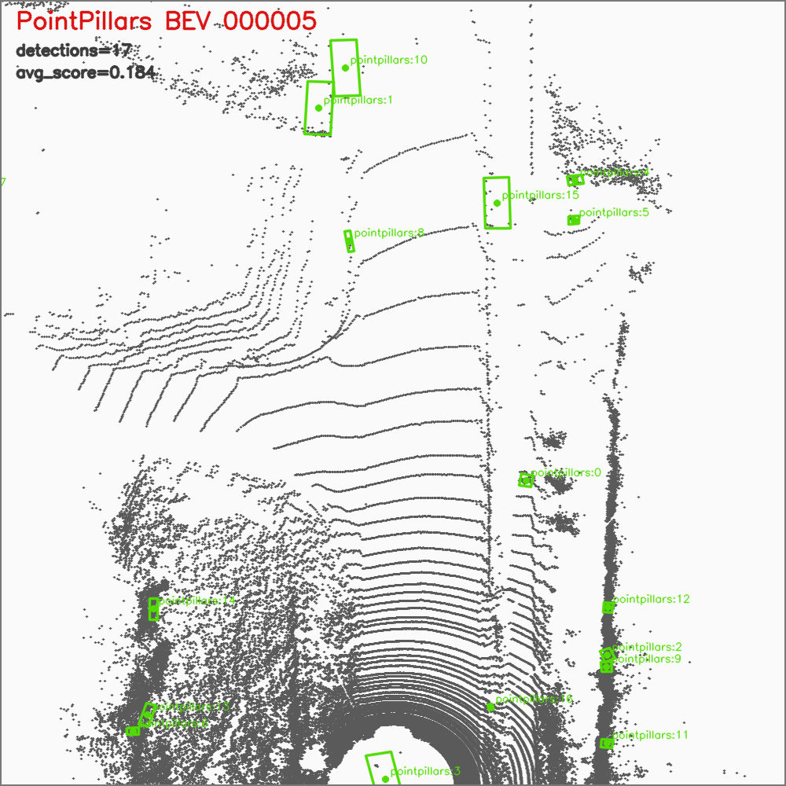
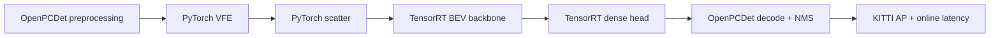

# LiDAR-相机感知、标定同步与 TensorRT 部署评测系统

[English](README_EN.md) · [架构](docs/ARCHITECTURE.md) · [代码地图](docs/CODE_MAP.md) · [实验矩阵](docs/EXPERIMENTS.md) · [结果边界](docs/RESULTS.md) · [面试提纲](docs/INTERVIEW_GUIDE.md)

> 2024–2025｜国家重点项目工程实践的公开验证仓库。公开内容只使用 KITTI / OpenPCDet 构建可披露的工程链路，不包含原项目的非公开数据、代码、模型或业务信息。




这个仓库不是单一的 PointPillars demo，而是一套围绕真实传感器与模型上线问题构建的工程系统：

- 从 KITTI 点云、标定与图像出发，完成 3D 检测、官方 AP、BEV 与 Camera 投影验证；
- 通过点云稀疏、噪声、距离裁剪、阈值、标定误差与错帧代理构建退化压力测试；
- 对 PyTorch 与 TensorRT 子图进行 shape、binding、decode、AP parity 和在线延迟验收；
- 用无标签运行质量指标和 failure matcher 定位输入、网络、后处理与 tracking 风险；
- 保留未成功和仅部分完成的实验状态，让结果具备可归因性。

## 结果摘要

| 模块 | 结果 | 证据边界 |
|---|---:|---|
| KITTI 官方评测 | Car / Pedestrian / Cyclist moderate 3D AP = **50.22 / 23.90 / 45.77** | 3,769 帧 validation |
| TensorRT 子图 | **6.745 → 3.635 ms（1.86×）** | BEV backbone + dense head |
| 在线检测总链路 | **33.076 → 28.480 ms** | 保留 PyTorch VFE/scatter 与原生后处理 |
| Tracking association | **47.267 → 0.836 ms（56.6×）** | 50 帧，向量化门控 + 局部 assignment |
| 部署验收矩阵 | **107 settings / 11,200 frame-runs** | 71 executed / 29 partial / 7 skipped |

简历中的 `6.85 → 3.68 ms` 是早期四舍五入口径；本仓库统一采用最终保留证据中的 `6.745 → 3.635 ms`。完整数据见 [`evidence/summary.json`](evidence/summary.json) 和 [`evidence/raw/`](evidence/raw/)。

## 系统链路



## 两个可视化检查面

| Camera-LiDAR 投影 | PointPillars BEV |
|---|---|
|  |  |

投影图用于检查标定链与图像几何是否一致；BEV 图用于检查预测框、朝向与空间关系。它们是快速审计入口，不替代官方 evaluator。

## TensorRT：先定义边界，再谈加速



仓库**不声称完整检测器全 TensorRT**。当前被 AP parity 与延迟共同验证的边界是 backbone/dense head；这种写法刻意保留了真实工程限制。详细调试链见 [代码地图](docs/CODE_MAP.md)。

## 退化与系统验收

| 误差源 | 注入方式 | 观测 |
|---|---|---|
| 点云稀疏 | 随机丢点 / pillar 变化 | AP、漏检、pillar 数、延迟 |
| 远距离 | range crop / 分段统计 | 40–60 m 风险、类别差异 |
| 点云噪声 | 坐标扰动 | 几何稳定性与异常框 |
| 标定误差 | yaw 扰动 | 重投影像素位移 |
| 时间偏移 | 相邻帧错配代理 | BEV 位移与几何一致性 |
| 推理差异 | PyTorch / TensorRT | tensor diff、AP parity、延迟 |

20 帧代理实验中，±2° yaw 对应约 **30.71 px** 平均重投影位移，±2 帧偏移对应约 **7.64–7.83 m** BEV 位移。后者是错帧敏感性代理，不是带 IMU/ego-motion 的真实在线同步算法。

## 代码规模与阅读入口

- `runtime/lidar_system_algorithm/`：I/O、标定、tracking、评测、部署与诊断运行库；
- `scripts/lidar_system_algorithm/`：**49** 个训练、评测、审计、bisection 与报告入口；
- `tests/`：**63** 个合同与回归测试文件；
- 核心源码与测试约 **22.8k LOC**；
- `evidence/raw/`：用于复核结论的 CSV，而不是只有展示图。

第一次阅读建议从 [`docs/CODE_MAP.md`](docs/CODE_MAP.md) 开始。TensorRT 调试主线是：binding contract → wrapper parity → submodule bisection → backbone/head AP parity → online latency。

## 快速测试

轻量核心测试不需要 KITTI、OpenPCDet 或 GPU：

```bash
python -m venv .venv
source .venv/bin/activate
pip install -e ".[dev,visualization]"
pytest -q \
  tests/test_lidar_calibration.py \
  tests/test_lidar_transforms.py \
  tests/test_lidar_tracking.py \
  tests/test_lidar_tracking_optimized.py \
  tests/test_lidar_dbscan_baseline.py \
  tests/test_lidar_failure_matcher.py
```

完整 PointPillars / TensorRT 复现需要自行准备 KITTI、OpenPCDet、权重和兼容的 CUDA/TensorRT 环境，详见 [`docs/REPRODUCIBILITY.md`](docs/REPRODUCIBILITY.md)。仓库不包含数据、权重、ONNX 或 engine。

## 已知限制

- PointPillars 是成熟检测基线，本项目的重点是系统评测、失效归因与部署验收。
- 小样本微调为 200 train / 50 val / 3 epochs，只用于验证管线，不代表完整收敛。
- failure matcher 用于类别/距离归因，不等同于 KITTI 官方 evaluator。
- 无标签健康指标只用于异常提示，不能替代 AP。
- 完整 TensorRT 动态 pillar bucket 精度仍未形成可复核闭环，因此明确保留为未完成项。

更多负结果与证据边界见 [`docs/RESULTS.md`](docs/RESULTS.md)。

## 许可证

原创代码、文档与图表采用 [PolyForm Noncommercial 1.0.0](LICENSE.md)：允许个人学习、学术研究和非商业实验、修改与再分发，**禁止未经授权的商业使用**。第三方组件与数据遵循各自条款，详见 [NOTICE](NOTICE.md) 与 [THIRD_PARTY](THIRD_PARTY.md)。
