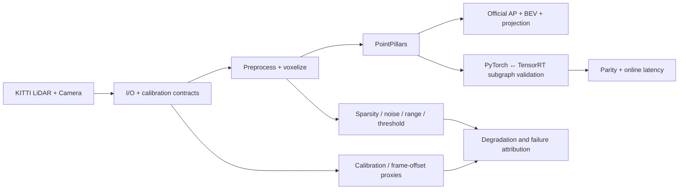

# LiDAR-Camera Perception, Calibration/Sync and TensorRT Deployment Benchmark

[中文首页](README.md) · [Architecture](docs/ARCHITECTURE.md) · [Code Map](docs/CODE_MAP.md) · [Experiments](docs/EXPERIMENTS.md) · [Results](docs/RESULTS.md)

> Public validation repository derived from engineering work conducted in 2024–2025. It uses only the public KITTI/OpenPCDet stack and contains no confidential project data, code, models, or business information.

This is not a single PointPillars demo. It connects 3D perception, camera-LiDAR geometry, degradation testing, official accuracy evaluation, bounded TensorRT acceleration, online latency profiling, failure attribution, and label-free runtime health signals.

## Verified highlights

| Module | Result | Evidence scope |
|---|---:|---|
| KITTI official evaluation | Car / Pedestrian / Cyclist moderate 3D AP: **50.22 / 23.90 / 45.77** | 3,769 validation frames |
| TensorRT subgraph | **6.745 → 3.635 ms (1.86×)** | BEV backbone + dense head |
| Online detection pipeline | **33.076 → 28.480 ms** | PyTorch VFE/scatter and native post-processing retained |
| Tracking association | **47.267 → 0.836 ms (56.6×)** | 50 frames |
| Acceptance matrix | **107 settings / 11,200 frame-runs** | 71 executed / 29 partial / 7 skipped |

The resume-level `6.85 → 3.68 ms` figure was an earlier rounded result. This repository uses the final retained measurement of `6.745 → 3.635 ms` as its source of truth.

## Pipeline

## Honest deployment boundary

The validated TensorRT boundary contains the BEV backbone and dense head. OpenPCDet preprocessing, PyTorch VFE/scatter, decode, NMS, and export remain outside the engine. The repository therefore does **not** claim a fully TensorRT detector.

## Repository map

- `runtime/lidar_system_algorithm/`: reusable geometry, evaluation, tracking, deployment, and diagnostics code;
- `scripts/lidar_system_algorithm/`: 49 training, evaluation, audit, bisection, and reporting entry points;
- `tests/`: 63 contract and regression test files;
- `evidence/raw/`: machine-readable evidence behind the headline results;
- `assets/figures/`: projection, BEV, latency, and diagnostic figures.

See the [Code Map](docs/CODE_MAP.md) for the recommended interview reading order and [Reproducibility](docs/REPRODUCIBILITY.md) for environment requirements.

## Limitations

- The adjacent-frame offset experiment is a synchronization degradation proxy, not a production IMU/ego-motion compensation system.
- The small fine-tuning run validates the pipeline but does not establish full KITTI convergence or SOTA.
- Label-free health metrics are anomaly signals, not substitutes for annotated AP.
- Full dynamic-pillar TensorRT accuracy is not yet closed and is retained as an explicit negative result.

## License

Original code, documentation, and figures are available under the [PolyForm Noncommercial License 1.0.0](LICENSE.md). Noncommercial study, research, modification, and redistribution are permitted; commercial use requires separate permission. Third-party assets retain their own terms.
