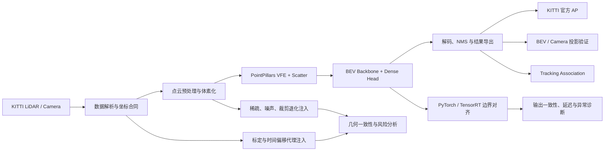
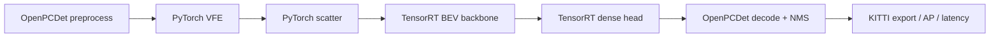

# 系统架构

## 1. 主链路

## 2. 坐标合同

KITTI 点云投影使用齐次坐标链：

$$
\tilde{p}_{img}=P_2 R_0 T_{velo\rightarrow cam}\tilde{p}_{velo}
$$

只保留相机坐标系深度为正的点，再执行透视除法：

$$
u=\frac{x'}{z'},\qquad v=\frac{y'}{z'},\qquad z'>0
$$

实现位于 `runtime/lidar_system_algorithm/calibration.py` 与 `transforms.py`；相应单元测试覆盖矩阵形状、方向和投影有效性。

## 3. TensorRT 的真实边界

本仓库只把 **BEV backbone 与 dense head** 声明为 TensorRT 加速边界。VFE、scatter 与后处理仍由 PyTorch/OpenPCDet 承担，因此不宣称“完整检测器全 TensorRT”。

## 4. 运行质量诊断

诊断层同时观测输入、预测和时延：

$$
H_t=\{N_{points},N_{pillars},N_{pred},s_{conf},d_{range},\Delta_t,\tau_{stage}\}
$$

这些指标用于报警和失效定位，不替代带标注的官方 AP。当前实验中 `prediction_count_drift` 与 AP 下降的相关性最高，但整体相关性有限，因此只能作为无标签异常代理。
