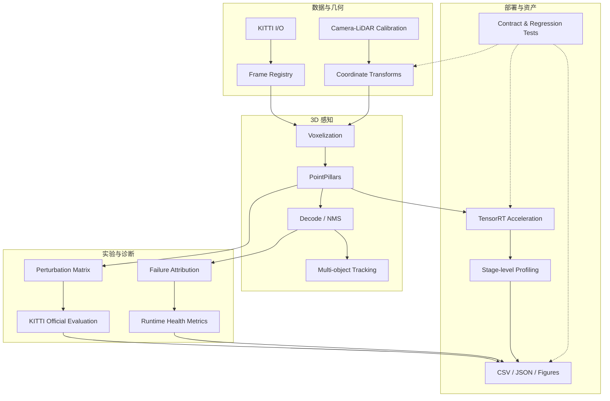
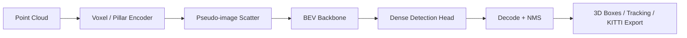

# 系统架构

## 模块总览



## Camera-LiDAR 几何

KITTI 标定链以齐次矩阵统一描述：

$$
\tilde{p}_{img}=P_2 R_0 T_{velo\rightarrow cam}\tilde{p}_{velo}
$$

透视投影为：

$$
u=\frac{x'}{z'},\qquad v=\frac{y'}{z'},\qquad z'>0
$$

`calibration.py` 负责标定文件解析，`transforms.py` 负责点、3D box 与 BEV polygon 的坐标变换，测试覆盖矩阵形状、变换方向和投影有效性。

## PointPillars 与部署链路



部署实验围绕模型输入输出合同、动态 pillar shape、子模块数值对齐和分阶段时延展开；`pointpillars_wrapper_runtime.py`、`tensorrt_bucketed_wrapper.py` 与 `online_latency.py` 提供主要运行实现。

## 实验数据组织

所有批量任务统一输出结构化记录：

```text
experiment setting
├── input statistics
├── model predictions
├── official metrics
├── per-class / per-range diagnostics
├── stage latency
└── figure and report assets
```

该结构支持对模型、传感器扰动和部署版本进行同口径对比，并由回归测试约束字段与结果结构。
