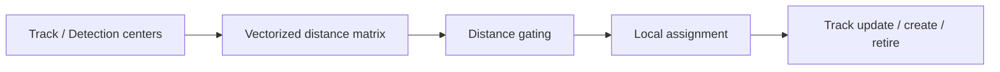

# 实验矩阵

## A. PointPillars 感知基线

| 实验 | 输入 | 输出 |
|---|---|---|
| KITTI data pipeline | 点云、图像、标定、标签 | frame registry、坐标验证、可视化 |
| PointPillars inference | KITTI validation | 3D boxes、scores、KITTI prediction files |
| Official evaluation | GT + prediction | Car / Pedestrian / Cyclist AP |
| Failure attribution | GT + prediction | class/range FP、FN、precision、recall |
| Subset fine-tuning | stratified split | checkpoints、loss curves、AP comparison |

## B. Camera-LiDAR 几何实验

| 变量 | 范围 | 记录 |
|---|---:|---|
| Yaw perturbation | -3° ～ +3° | mean / median / P95 reprojection shift |
| Translation X/Y/Z | -0.2 ～ +0.2 m | projected-point displacement |
| Adjacent frame offset | -5 ～ +5 frames | BEV center displacement、association change |

共覆盖 20 个 KITTI frame、830 条实验记录。

## C. 感知压力测试

| 变量 | 设置 | 指标 |
|---|---|---|
| Point dropout | 0%–80%，11 档 | AP、pillar count、FP/FN、prediction drift |
| Range crop | 20–70 m，11 档 | AP、class/range recall、box distribution |
| Score threshold | 0.00–0.60，13 档 | AP、box count、score distribution |
| Deployment precision | OpenPCDet / wrapper / TensorRT | tensor diff、AP、latency |

组合形成 107 组系统设置与 11,200 次 frame-run。

## D. TensorRT 与在线性能

1. 环境、CUDA/NVVM 与 engine compatibility 检查；
2. wrapper batch dict、binding 与动态 shape 验证；
3. PyTorch core parity 与子模块 bisection；
4. scatter padding、direction classifier 与 decode alignment；
5. backbone/head AP 对比；
6. 预处理、网络、NMS、tracking 与在线总延迟 profiling。

## E. Tracking Association 优化

通过矩阵化中心距离计算、候选门控和局部 assignment，将 association 从 47.267 ms 优化到 0.836 ms。

## F. 证据资产与可视化

- 18 份机器可读 CSV，共 16,000+ 条实验记录；
- 16 张作品集图覆盖系统总览、AP/延迟、同帧 CDF、阶段 profiler、资源消融、类别/距离退化、运行质量、tracking 与预测分布；
- 所有图由 `scripts/portfolio/generate_portfolio_figures.py` 生成，定量结论可回溯到 `evidence/raw/`。
